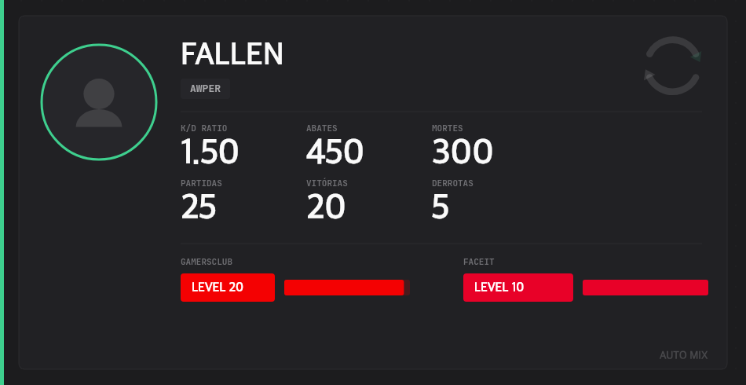
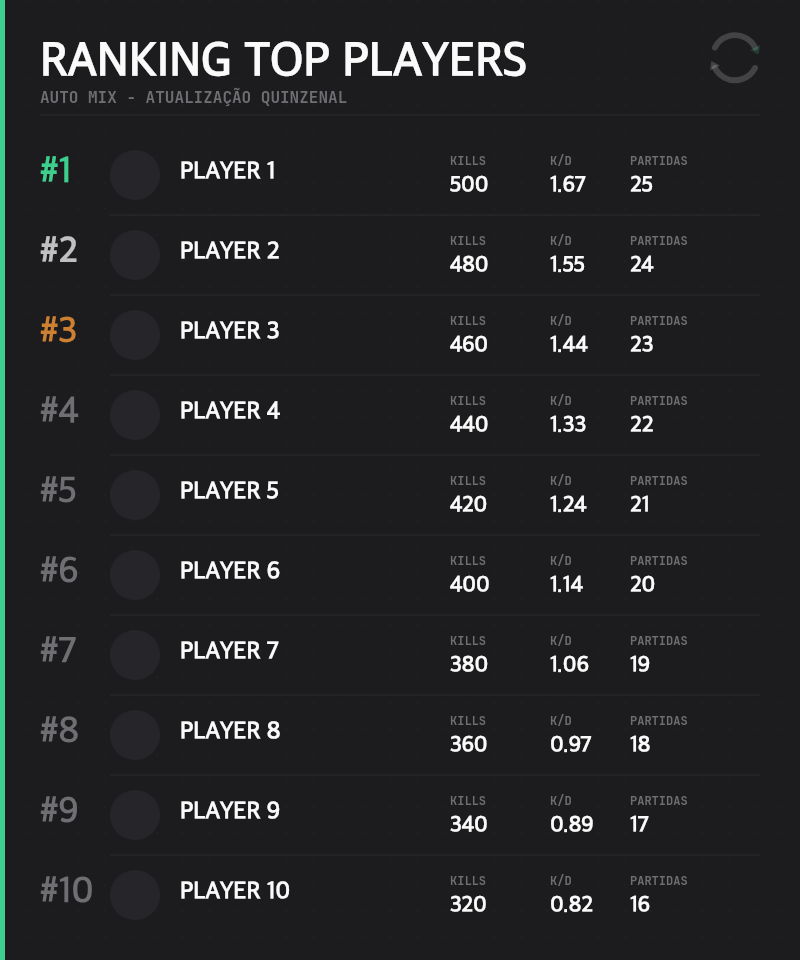

# Auto Mix

O **Auto Mix** é um bot para Discord criado para automatizar completamente as partidas 5v5 ("mixes") de Counter-Strike 2 (CS2) dentro do seu servidor.

Com zero necessidade de configuração para os jogadores, o bot gerencia a divisão dos times, escolha de mapas, gerenciamento de canais de voz, rastreamento de estatísticas e a geração de rankings competitivos.

## 🌟 Funcionalidades

- 🎮 **Modos de Matchmaking:** Escolha entre o formato "Capitães" (onde dois jogadores escolhem seus times alternadamente) ou o modo "Aleatório".
- 🗺️ **Sistema de Pick & Ban:** Veto interativo de mapas embutido no Discord, MD1 e MD3. A sequência é gerada a partir do tamanho do `MAP_POOL` — adicionar ou remover mapas não quebra o veto.
- 🔊 **Canais de Voz Automáticos:** O bot cria canais de voz temporários (ex: `MIX - NAVI` vs `MIX - FURIA`), move os 10 jogadores automaticamente para seus respectivos times e **restringe as permissões de fala para que espectadores fiquem mutados**. Os canais são apagados sozinhos no final.
- 📊 **Estatísticas e K/D:** Os jogadores registram seus abates e mortes no final da partida, e o bot calcula o K/D acumulado dentro do servidor.
- ⚙️ **Configuração Rápida:** Painel interativo para os jogadores selecionarem suas funções em jogo (IGL, Entry, AWP, etc.) e níveis de GC/Faceit.

## 🖼️ Imagens Dinâmicas (Cards & Ranking)

O bot conta com a identidade visual **"Auto"** — um design premium, minimalista e voltado para os esports, utilizando tons de grafite, um verde menta de destaque e as fontes **Sora** e **JetBrains Mono**.

Todas as imagens são geradas dinamicamente e em alta resolução pelo bot usando o Canvas.

### 👤 Cartão de Perfil (`/perfil`)
Gera um cartão visual mostrando o avatar do usuário, sua função no jogo, K/D, total de abates, níveis e histórico de vitórias/derrotas.


### 🏆 Ranking Automático
Todo dia ao meio-dia o agendador verifica a data; nos dias **15 e no último dia do mês** ele posta o Top 10 do servidor no canal definido em `/set-ranking-channel`.


## 💻 Requisitos

- Node.js v20+ (recomendado)
- TypeScript
- `@napi-rs/canvas` (Atenção: algumas hospedagens Linux exigem dependências no sistema. No Discloud, adicione `APT=canvas` no config)
- `sql.js` (SQLite em WebAssembly, persistido em `data.db`)
- `@laihoe/demoparser2` (parser de demos CS2 — binário nativo, prebuilds para linux x64)

## 🚀 Instalação

1. Clone o repositório e instale as dependências:
```bash
npm install
```

2. Crie um arquivo `.env` na raiz do projeto e adicione suas credenciais do bot do Discord:
```env
DISCORD_TOKEN=seu_token_aqui
CLIENT_ID=seu_client_id_aqui
```

3. Registre os "Slash Commands" no Discord:
```bash
npm run deploy
```

4. Inicie o bot:
```bash
npm start
```
*(Para desenvolvimento local com recarregamento automático, utilize `npm run dev`).*

## 📌 Comandos

### Mix
- `/mix` — Inicia um mix 5v5. Exige **10 ou mais** jogadores no mesmo canal de voz; com mais de 10, abre partidas simultâneas.
- `/mix-fim` — Registra manualmente abates, mortes e resultado após a partida.

### Steam e estatísticas
- `/steam vincular` — Vincula seu perfil da Steam (link ou SteamID64) ao seu Discord. **Necessário para as demos creditarem suas stats.**
- `/steam ver` — Mostra a conta da Steam vinculada (sua ou de outro jogador).
- `/steam remover` — Remove o vínculo.

### Comunidade
- `/perfil` — Gera e exibe o seu cartão de perfil personalizado.
- `/ranking` — Gera instantaneamente a imagem do Top 10 atual do servidor.
- `/resetkd` — Zera o **seu** K/D.
- `/resetpartidas` — Zera as **suas** partidas.

### Admin (requer permissão *Gerenciar Servidor*)
- `/setup` — Envia o painel de configuração para os jogadores pegarem cargos de GC, Faceit e função.
- `/set-ranking-channel` — Define o canal onde o ranking quinzenal é postado automaticamente.

## 🌐 Site (ranking + envio de demo)

O site roda **no mesmo processo do bot**, compartilhando o mesmo `data.db`.

**O site inteiro exige login com Discord** e ser membro do servidor definido em `GUILD_ID` — nem o ranking aparece pra quem não entrou. Todas as rotas `/api` respondem 401 sem sessão válida; a única exceção é `/api/session`, que é justamente quem responde se a pessoa está logada.

Cinco abas:

| Aba | O que tem |
|---|---|
| **Ranking** | Top do servidor por ADR, filtrável por 7/15/30 dias e geral. Clicar numa linha abre o perfil. |
| **Jogadores** | Todo mundo que já apareceu numa demo, com busca por nome ou SteamID64. |
| **Partidas** | Histórico de partidas. Clicar abre o placar completo dos dois times; os nomes ali também levam ao perfil. |
| **Enviar demo** | Upload do `.dem` com barra de progresso e acompanhamento do processamento. |
| **Meu perfil** | Suas estatísticas e seu histórico. |
| **Staff** | Só aparece para quem tem o cargo `STAFF_ROLE_ID`. Lista os jogadores marcados. |

O perfil de qualquer jogador mostra ADR, K/D, HS%, aproveitamento, posição no ranking geral e o histórico completo de partidas — e cada linha do histórico abre o placar daquela partida.

### Como funciona o fluxo da demo

1. O jogador roda `/steam vincular` no Discord.
2. No site, faz login com o Discord e envia o `.dem` da partida (Xplay.gg).
3. O parser roda **em processo separado**, lê placar, mapa e stats por SteamID64, e credita tudo em quem tiver a Steam vinculada.
4. O `.dem` é apagado logo após o parse — demos de ~200 MB não ficam ocupando disco.
5. O bot manda o resultado no privado de quem enviou.

> **Não há download de demo no site.** Como o arquivo é apagado após o parse, não existe o que baixar. Para oferecer download seria preciso guardar as demos em algum lugar — object storage externo (Cloudflare R2 tem 10 GB grátis e sem taxa de egress) ou um esquema rotativo que mantém só as N últimas no disco.

Quem não tinha a Steam vinculada na hora do envio **não perde as stats**: os dados ficam guardados por SteamID64 e são aplicados retroativamente quando a pessoa rodar `/steam vincular`.

### Stats extraídas

Placar final, mapa, rounds, e por jogador: kills, deaths, assists, ADR, HS% e resultado.

O ADR é calculado pela **vida efetivamente perdida** pelo alvo, não pelo campo `dmg_health` da demo — esse campo vem sem limite (numa demo real apareceu um evento marcando 459 de dano num único tiro) e infla o ADR em ~25%.

### Rodando local

```bash
cp .env.example .env    # preencha DISCORD_TOKEN, CLIENT_ID, GUILD_ID, CLIENT_SECRET, SESSION_SECRET
npm install
npm run build:local
npm start               # site em http://localhost:8080
```

No **Discord Developer Portal → OAuth2 → Redirects**, cadastre a URL de callback:
`http://localhost:8080/auth/callback` (local) e `https://SEU-ID.discloud.app/auth/callback` (produção).

### Área de staff

Quem tem o cargo definido em `STAFF_ROLE_ID` vê uma aba extra e, no perfil de qualquer jogador, um painel para marcar suspeita de cheat.

Níveis: **Limpo → Observando → Suspeito → Confirmado → Banido**. Toda mudança exige motivo e grava quem marcou, quando e por quê — marcação de cheat sem histórico vira boato.

**Banir no site bane no Discord.** O bot executa o banimento no servidor, e tirar a marcação desbane. Para funcionar, o bot precisa da permissão *Banir Membros* e o cargo dele tem que estar **acima** do cargo do jogador. Se o jogador nunca vinculou a Steam, não há Discord ID para banir: a marcação vale no site e a staff é avisada.

Nada disso vaza para membro comum — as rotas `/api/staff/*` respondem **404** para quem não é staff, e o campo da marcação nem existe nas respostas das rotas normais.

O cargo é conferido **a cada requisição**, não guardado no cookie: quem perde o cargo perde o acesso na hora, em vez de manter por até 7 dias.

## 🏗️ Arquitetura

- Desenvolvido sobre [Discord.js v14](https://discord.js.org/)
- Banco de dados leve rodando em `sql.js`
- Fortemente tipado com TypeScript
- Geração de imagens otimizada com `@napi-rs/canvas`
- Rotinas e eventos automáticos controlados por `node-cron`

## 📦 Hospedagem (Discloud)

O `discloud.config` usa **`TYPE=site`**, não `TYPE=bot`. Um app `TYPE=bot` não recebe URL pública na Discloud — o `TYPE` só decide se a porta 8080 fica exposta num subdomínio. O mesmo processo continua rodando o bot do Discord normalmente.

```
TYPE=site
ID=auto-mix          # vira auto-mix.discloud.app
MAIN=dist/index.js
RAM=2048
APT=canvas
BUILD=npm install && npm run build:local
```

O app precisa escutar em `0.0.0.0:8080` — já é o padrão do `.env.example`.

> Hospedar sites exige plano pago na Discloud. A documentação cita Platinum ou superior; a tabela de planos indica Diamond. Confirme no seu painel antes do deploy.

### Custo do parser

Medido numa demo real de 197 MB (de_ancient, 18 rounds): **3,8 s de parse** e **pico de 106 MB de RSS**. Cabe nos 2 GB com folga, mas o parse é 100% síncrono — por isso roda em processo filho, senão o bot ficaria mudo no Discord durante o processamento.

Para empacotar antes do upload:
```bash
node zip-bot.js
```

## 📜 Licença

Uso Privado. Desenvolvido para o ecossistema Auto Bot.
